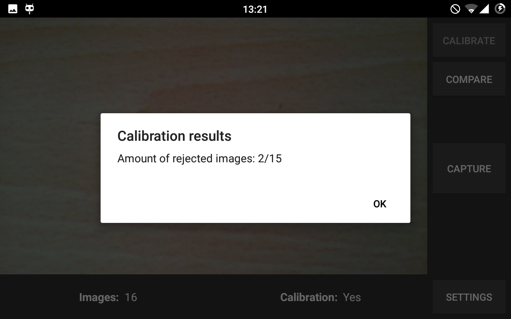

# Checkerboard IMU Comparator

**Checkerboard IMU Comparator** is an Android application which compares rotation data from IMU sensor with rotation matrix based on checkerboard pattern. Application uses _OpenCV_. It was created in march 2016 as an project for university.

**Important notes:**
- this applciation needs _**OpenCV Manager**_ installed to work properly. You can find it on [_Google Play_](https://play.google.com/store/apps/details?id=org.opencv.engine&hl=pl) or in [extras/apks/opencv_menager.apk](extras/apks/opencv_menager.apk)
- apk file of application is located in [extras/apks/checkerboard_imu_comparator.apk](extras/apks/checkerboard_imu_comparator.apk)
- testing 9x6 checkerboard is located in [extras/checkerboard_9x6.png](extras/checkerboard_9x6.png)

### Project Description

### SettingsActivity

   
- At the beginning you have to update the following information:
  - necessary number of images to calibrate camera (10 - 20, default 15)
  - width of checkerboard (>3, default 9)
  - height of checkerboard (>3, default 6)
  
- You can restore settings to default by clicking _Restore defeaults_. All settings are restored, and all saved images are deleted.

- You can save changes by selecting _Save changes_. Data is stored using _SharedPreferences_.

### MainActivity
- The first step is to take a specific number of photos (set in _SettingsActivity_) to calibrate the camera.

- During calibration process, there is shown a progress dialog. After this operation there is shown an information with the results. If calibration is succeeded the camera matrix and distortion coefficients are stored in SharedPreferences.

  
 

- After calibration, rotation data can be compared by taking a picture, and clicking "_Compare_". If chessboard pattern hasn't been recognised, there is shown a message Toast. If pattern has beed recognzed there is shown a dialog with comparation results, which are also saved in txt file.

  
 

### Licensing
_Checkerboard IMU Comparator_ is licensed under **_Apache 2.0_** license. You can read more about the terms of this license on the [web page](https://www.apache.org/licenses/LICENSE-2.0) or in [LICENSE.txt](/LICENSE.txt) file.